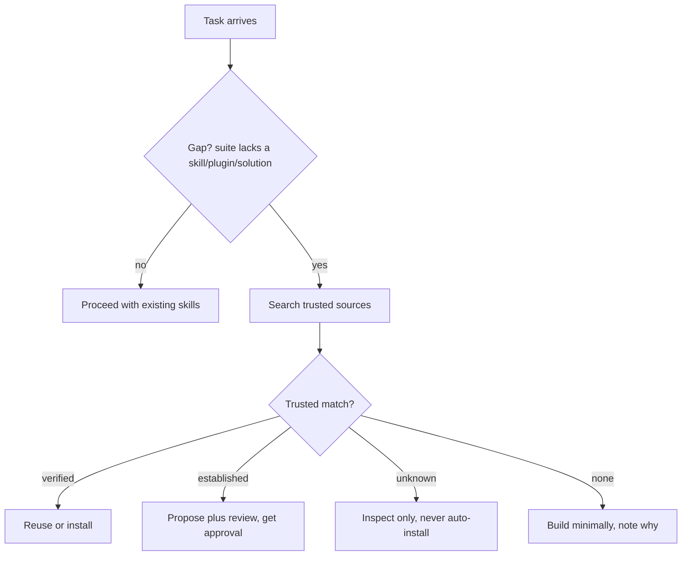

# Acquiring Capabilities

Don't burn tokens rebuilding what already exists and is trusted. When you hit a
capability gap or an unfamiliar domain, **search first, then reuse, then build**.

## 1. Recognize the gap (do this early, cheaply)

Before implementing anything non-trivial, ask: does a skill/plugin/agent/MCP
server or a well-known solution already cover this? Signals: unfamiliar
framework, auth/payments/parsing/date-time, a whole category your suite has no
skill for.

## 2. Search trusted sources (not random)

Use `websearch` + `webfetch` + `gh` for the fast path — never crawl blindly.
Curated source list and install snippets: `references/trusted-sources.md`.

Trust tiers (see the reference for the list):

- **Verified** — official/curated (opencode.ai ecosystem, `anthropics/*`, the
  upstreams this suite already vendors) or already pinned in the project →
  reuse/install directly.
- **Established** — popular (≥1k stars), active (<6mo), permissive license,
  identifiable maintainer, readable source → propose with a 3-line summary and
  get approval before installing.
- **Unknown** — anything else → inspect read-only, surface it to the human,
  never auto-install.

## 3. Security review before any install (mandatory)

Third-party code is a trust boundary. Reject if: obfuscated/minified source,
`postinstall`/`preinstall` hooks that fetch-and-exec, unexplained network
calls, hardcoded secrets, or missing license. Prefer vendoring into the
project (reviewable in the diff) and pin exact versions/commits so installs
are reproducible. Never auto-install on behalf of the human without the tier
rule above.

## 4. Reuse proven solutions, don't reinvent

For code/config problems, prefer an authoritative source over ad-hoc: the
project's own patterns, the stdlib, official docs, MDN, framework docs, and
well-known reference repos. Cite the source (`url` or `path:line`) next to
what you copied or adapted, and keep only the minimal part.

## 5. Fallback

Nothing trustworthy found → build the minimum (lean ladder) and add a one-line
note: source searched, why reuse was rejected, and the ceiling/upgrade path.
