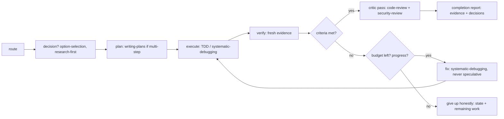

# Autonomous Loop

Drive a goal to done **without asking**. Each iteration is a full SDLC pass.
Stop only when acceptance criteria are met with fresh evidence, or a budget
rule fires.

## Setup (once)

- Restate the goal + **acceptance criteria** (observable, verifiable).
- Declare the **budget**: 3 iterations unless the human set one.
- Create the progress ledger `docs/plans/<slug>-progress.md` (format and
  handover rules per `managing-tasks`) — it survives compaction and drives
  the give-up-honestly report.

## Loop (repeat until a stop rule fires)

1. **Route** with `using-sdlc-lean` (feature/bugfix/refactor/research) and
   invoke the pipeline skill first.
2. **Decide** every fork via `option-selection`: research, matrix, pick,
   record. Never ask the human to choose.
3. **Plan** with `writing-plans` for multi-step work; skip for one-liners.
4. **Execute** with `test-driven-development`, or `systematic-debugging` for
   bugs.
5. **Verify** with `verification-before-completion`: run the repo's commands,
   reuse `docs/verify-recipe.md` if it exists, else write it.
6. **Correct**: on failure, one fix round via `systematic-debugging`; record
   what changed each round in the ledger.

## Stop rules (first that fires wins)

| Rule | Action |
|---|---|
| Criteria met, fresh evidence | critic pass → completion report |
| 2 consecutive no-progress loops | change strategy (different approach), not the same fix again |
| Budget exhausted | **give up honestly**: state, evidence, exact remaining work, next step |
| Human interrupts | pause, report loop state from the ledger |

## Rules

- Never claim done without fresh verification output.
- Safety guards (destructive ops, secrets) are not negotiable — never loop
  around them.
- Update the ledger every iteration; it is the memory that survives compaction.
- Subagent work fans out per `dispatching-parallel-agents`; merge per its
  contract.
