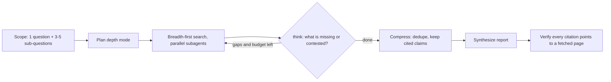

# Deep Research

Evidence over vibes. Plan → parallel search → assess gaps → cite → synthesize.
Reimagined from dzhng/deep-research (recursive breadth/depth), LangChain
open_deep_research (`think_tool`, compression), and gpt-researcher (source
curation), adapted to a prompt-only skill with websearch/webfetch + subagents.

## Depth modes (pick one, announce it, never ask the user to choose)

| Mode | Rounds | Sub-questions | Sources target | Use when |
|---|---|---|---|---|
| quick | 1 pass | 3–5 | ~5–10 | one focused factual question |
| standard (default) | 1 wide + 1 gap round | 3–5 | ~10–20 | comparisons, "what is the state of X" |
| deep | 2–3 rounds | 4–6 | 20–40+ | high-stakes decisions, due diligence |

## 1. Scope

Turn the request into **one explicit research question**; list **3–5
non-overlapping sub-questions**; state in-scope and out-of-scope in one line.
Ask at most **one** clarifying question, and only if the goal is genuinely
ambiguous — otherwise state your interpretation and proceed.

## 2. Search (start wide, then narrow)

- 2–3 keyword variants per sub-question; broaden first, then drill in.
- **Prefer primary/authoritative sources** over aggregators and SEO content:
  official docs, papers, filings, first-party sites, maintainers' own pages.
  See `references/source-quality.md` (evidence hierarchy + SIFT + red flags).
- For independent sub-questions, dispatch the `researcher` subagent — **all in
  one message** so they run in parallel (fan-out; contract in
  `dispatching-parallel-agents`). Give each: objective, the output schema, the
  source boundary, and its search budget. Subagents return distilled findings,
  **never raw pages** (keeps context small).
- Reuse `acquiring-capabilities` trust rules: no random blogs, no unsourced
  forums, no AI-generated listicles.

## 3. Assess (`think_tool`)

After each round, pause and write one short gap analysis: what is now
supported, what is still missing, what sources conflict. Generate the next
round's queries from **angles, not synonyms**, and shrink breadth as depth
increases (a follow-up round uses fewer, sharper queries).

## 4. Compress (fan-in)

Dedupe by URL; merge duplicate facts; keep only claims that carry a citation;
preserve citation numbers. Never drop a source that supports a kept claim.
Resolve conflicts per `dispatching-parallel-agents` (stated rule or escalate),
and list what remains unanswered.

## 5. Synthesize + verify

- Output per `references/report-format.md` and the 30s contract
  (`communicating-concisely`): executive summary first, then themed sections
  with a mermaid/table where it clarifies. Write long reports to a file and
  return the summary + path + `sources_reviewed: N`.
- **Verify**: every citation `[n]` points to a page you actually fetched and
  whose content you read — never the search engine, never a snippet-only hit,
  never an invented URL. If it can't be verified, cut the claim.
- End with confidence labels, unresolved conflicts, and open questions.

## Citation discipline

- Every substantive claim carries an inline `[n]`; `## Sources` lists them
  sequentially with no gaps.
- Label confidence: **high** (3+ independent sources agree), **medium** (2),
  **low** (1 source, or sources conflict).
- Single-source claims are marked "unverified". Separate fact / estimate /
  opinion. If evidence is missing, write "insufficient data found" — never pad.

## Hard budgets (stop even if not done)

Per subagent: 3–5 searches. Global: the mode's source target. Stop when 3+
independent sources agree, when a round adds no new material, or when the last
two searches return the same information. Report what remains unanswered.

## Anti-patterns

- No subagents for a quick lookup; no synonym queries as separate agents.
- Never treat a search hit as validated; never cite the engine instead of the page.
- No blog-only sourcing for factual claims; no repeating content across sections.
- Don't run endless rounds — budget out, then report gaps honestly.
