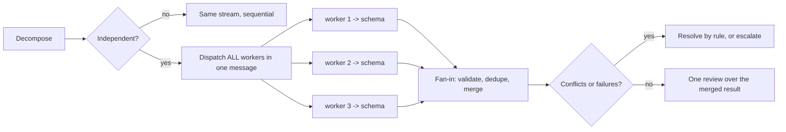

# Fan-out / Fan-in

Two phases. Most parallel work fails at **fan-in** — merging without a contract
duplicates results, loses work, or silently hides conflicts.

## Fan-out (dispatch)

- **Independence test**: workers share no files/state AND neither depends on the
  other's outcome. Shared files or ordering → same stream, sequential.
- One worktree per writing stream (`using-git-worktrees`).
- Each brief is self-contained: objective, exact inputs, **output schema**,
  boundaries, budget. Workers can't see each other's work.
- Dispatch **all** independent workers in a single message so they run concurrently.
- Workers stay dumb: no re-planning, no scope growth, no cross-talk; escalate surprises.

## Fan-in (merge) — the part people skip

- **Validate** every result against its schema; reject empty or malformed results.
- **Dedupe** by key (URL, file, symbol, claim) — never count one finding twice.
- **Merge in dependency order**; last-writer-wins only with an explicit
  source-of-truth rule, never silently.
- **Conflicts**: resolve with a stated rule (primary source / most recent /
  owner) or escalate to the human. Never average or hide a conflict.
- **Partial failure**: retry once; if it still fails, proceed with the rest and
  list the gap explicitly.
- **One final review** over the merged result (whole-branch, or the report).
  Never ship raw per-worker outputs unreviewed.

Reused by `subagent-driven-development` (per-task workers → whole-branch review)
and `deep-research` (parallel `researcher` subagents → single cited report).
