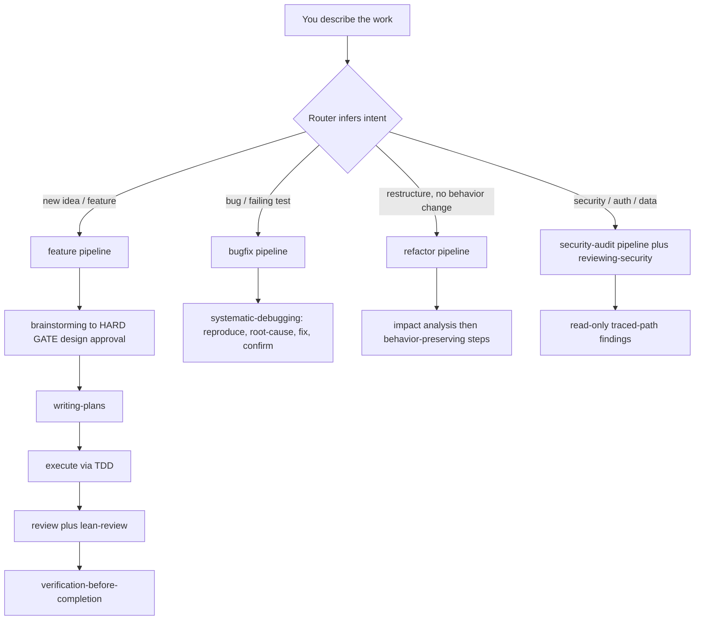

# sdlc-lean

A generic OpenCode SDLC suite for any project: superpowers' workflow discipline
filtered through ponytail's leanness, plus the best ideas from the wider agent
ecosystem. You just describe the work — it infers the pipeline and runs the
skills and subagents itself. No modes, no setup questions.



Every route scales scrutiny to the task: trivial work is built directly,
standard work enforces the lean ladder, architectural work runs the full
`brainstorming` flow first.

## Install

**Project-local** — this repo is the source of truth:

```sh
cp -r .opencode /path/to/your-project/
```

**Global** — available in every project:

```sh
cp -r .opencode/skills/*   ~/.config/opencode/skills/
cp -r .opencode/agents/*   ~/.config/opencode/agents/
cp -r .opencode/commands/* ~/.config/opencode/commands/
mkdir -p ~/.config/opencode/plugins
cp .opencode/plugins/sdlc-lean.js ~/.config/opencode/plugins/
```

Restart OpenCode. Zero dependencies. Works on OpenCode V1 (1.18.x, verified)
and V2 (dual export). Pair with [snip](https://github.com/edouard-claude/snip)
for 60–90% shell-output token savings — complementary, not bundled.

## What's inside

| Area | Contents |
|---|---|
| Skills (24) | router · brainstorming · writing-plans · worktrees · sdd / executing-plans · TDD · debugging · verification · review in/out · finish-branch · parallel-agents · writing-skills · diagnosing · lean-review · security · performance · schemas · release-notes · exploring-codebase · managing-tasks · communicating-concisely · acquiring-capabilities |
| Agents (6) | implementer · planner · code-reviewer · test-writer · explorer · security-reviewer |
| Pipelines (4) | `/feature` · `/bugfix` · `/security-audit` · `/refactor` — invoked automatically by the router |
| Plugin | per-session bootstrap, auto-routing, always-on safety guards |

## Human-facing output contract

Every response and generated doc follows `communicating-concisely`: a
~30-second attention budget (~120 words default), answer-first, and visuals
over walls — mermaid for flows/architecture/schemas, tables for comparisons
and task lists, progressive disclosure for detail. Plans and designs are a
diagram plus a table, not an essay.

## Reuse before rebuild

When the suite hits a capability gap or an unfamiliar domain, the router runs
`acquiring-capabilities`: search curated marketplaces and authoritative sources
(the OpenCode ecosystem, `anthropics/skills`, wshobson/agents, upstreams this
suite vendors), then reuse or install instead of reimplementing.

Trust is tiered — **verified** (official/curated) installs directly,
**established** (popular, active, permissive license) needs approval after a
security review, **unknown** is inspect-only. Third-party code is a trust
boundary: no obfuscated source, no rogue lifecycle hooks, pinned versions.
Sources and install paths: `.opencode/skills/acquiring-capabilities/references/trusted-sources.md`.

## Safety

Trust-boundary validation, data-loss handling, security, accessibility, and
one runnable check for non-trivial logic are **never** cut by the lean ladder.
The plugin also blocks known-destructive shell commands and refuses to read
`.env` / private keys, at every level.

## Verify

```sh
node scripts/validate-skills.mjs   # static skill lint
node --test "tests/opencode/*.mjs" # plugin, budget, and safety tests
```

Live-harness verification: [`eval/results/2026-09-27-dogfood.md`](eval/results/2026-09-27-dogfood.md).

## Credits

Built on patterns from MIT-licensed upstream work:
[obra/superpowers](https://github.com/obra/superpowers) (workflow + plugin skeleton),
[DietrichGebert/ponytail](https://github.com/DietrichGebert/ponytail) (lean ladder),
plus ideas from wshobson/agents, ClaudeTools/marketplace, osmontero/opencode-skills,
opencode-snip, and the awesome-opencode ecosystem. See [LICENSE](LICENSE).
