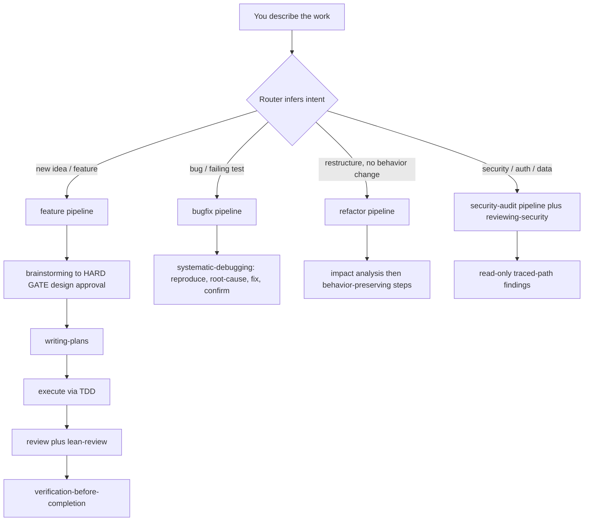

# sdlc-lean

A generic OpenCode SDLC suite for any project: superpowers' workflow discipline
filtered through ponytail's leanness, plus the best ideas from the wider agent
ecosystem. You just describe the work — it infers the pipeline and runs the
skills and subagents itself. No modes, no setup questions.

**New here? See [USAGE.md](USAGE.md) for step-by-step install and workflows.**



Every route scales scrutiny to the task: trivial work is built directly,
standard work enforces the lean ladder, architectural work runs the full
`brainstorming` flow first.

## Install

**Project-local** — this repo is the source of truth:

```sh
cp -r .opencode /path/to/your-project/
```

**Global** — available in every project, one command:

```sh
npm run install:global
```

Copies skills/agents/commands/plugin into `~/.config/opencode/` and prunes
files a previous install placed that no longer exist in the repo — your own
skills and config are never touched. Manual equivalent:

```sh
cp -r .opencode/skills/*   ~/.config/opencode/skills/
cp -r .opencode/agents/*   ~/.config/opencode/agents/
cp -r .opencode/commands/* ~/.config/opencode/commands/
mkdir -p ~/.config/opencode/plugins
cp .opencode/plugins/sdlc-lean.js ~/.config/opencode/plugins/
```

**Updating** (this PC or any other with a clone): `git pull && npm run install:global`.
First time on a new machine: `git clone <repo-url> ~/sdlc-lean && cd ~/sdlc-lean && npm run install:global`.

> **Double-install note (inside this repo):** OpenCode loads both
> `~/.config/opencode/plugins/` and `<project>/.opencode/plugins/`. On V1 this
> failed with "failed to load plugin sdlc-lean"; on V2.0.22 both loading has
> been verified working (TUI session + headless `opencode run`). If you ever
> see the load failure, remove the global copy
> (`rm ~/.config/opencode/plugins/sdlc-lean.js`) — the project-local plugin
> already covers this directory.

Restart OpenCode after installing. No dependencies. Works on OpenCode V1
(1.18.x) and V2 (2.0.x, verified) — V2 auto-loads the global plugin from
`~/.config/opencode/plugins/`. Pair with
[snip](https://github.com/edouard-claude/snip) for 60–90% shell-output token
savings — complementary, not bundled.

## What's inside

| Area | Contents |
|---|---|
| Skills (32) | router · brainstorming · writing-plans · worktrees · sdd / executing-plans · TDD · debugging · verification · review in/out · finish-branch · parallel-agents · writing-skills · diagnosing · lean-review · security · performance · schemas · release-notes · exploring-codebase · managing-tasks · communicating-concisely · simplified-technical-english · acquiring-capabilities · deep-research · incident-postmortem · dependency-upgrade · threat-model · adr · autonomous-loop · option-selection |
| Agents (8) | orchestrator · implementer · planner · code-reviewer · test-writer · explorer · security-reviewer · researcher |
| Pipelines (4) | `/feature` · `/bugfix` · `/security-audit` · `/refactor` — invoked automatically by the router |
| Autonomy | `orchestrator` primary agent + `autonomous-loop` + `option-selection` — goal-driven loops (route → research → pick best option → execute → verify → self-correct) until acceptance criteria or an honest budget stop |
| Status | `/sdlc-lean` — activation proof + installed skills/agents/commands |
| Plugin | per-session bootstrap, auto-routing, always-on safety guards |
| Eval | `npm run eval` — opt-in live harness, dry by default, with token/cost telemetry |

## Human-facing output contract

Every response and generated doc follows `communicating-concisely`: a
~30-second attention budget (~120 words default), answer-first, and visuals
over walls — mermaid for flows/architecture/schemas, tables for comparisons
and task lists, progressive disclosure for detail. Plans and designs are a
diagram plus a table, not an essay. Long prose and generated docs also apply
`simplified-technical-english` — an ASD-STE100-informed subset (~80%), never
claimed as certified.

## Debt ledger

Deliberate shortcuts and deferred work are recorded in a debt ledger
(`docs/debt-ledger.md`; format ships in the `lean-review` skill). `refactor`
and `lean-review` read and write it, so a side improvement never grows an
unrelated diff.

## Reuse before rebuild

When the suite hits a capability gap or an unfamiliar domain, the router runs
`acquiring-capabilities`: search curated marketplaces and authoritative sources
(the OpenCode ecosystem, `anthropics/skills`, wshobson/agents, upstreams this
suite vendors), then reuse or install instead of reimplementing.

Trust is tiered — **verified** (official/curated) installs directly,
**established** (popular, active, permissive license) needs approval after a
security review, **unknown** is inspect-only. Third-party code is a trust
boundary: no obfuscated source, no rogue lifecycle hooks, pinned versions.
Sources and install paths: `.opencode/skills/acquiring-capabilities/references/trusted-sources.md`.

## Deep research

Questions that need external evidence route to `deep-research`: it scopes the
question, runs breadth-first parallel searches (dispatching the `researcher`
subagent per sub-question), assesses gaps, then synthesizes a cited report.
Discipline is enforced — evidence hierarchy for sources, inline `[n]` citations
to pages actually fetched, confidence labels, honest "insufficient data"
instead of invented sources, and hard search budgets. Adapted from
dzhng/deep-research, LangChain `open_deep_research`, and gpt-researcher.

## Parallel work (fan-out / fan-in)

Independent work fans out — one worker per independent task, all dispatched in
a single message — and results fan back in through a merge contract: validate
against the output schema, dedupe by key, merge in dependency order, resolve
conflicts by a stated rule (never silently), handle partial failures, then one
review over the merged result. `dispatching-parallel-agents` owns the contract;
`subagent-driven-development` and `deep-research` reuse it.

## Safety

Trust-boundary validation, data-loss handling, security, accessibility, and
one runnable check for non-trivial logic are **never** cut by the lean ladder.
The plugin also blocks known-destructive shell commands and refuses to open
`.env` / private keys — through the read/edit/patch tools or common shell
readers — at every level.

## Verify

```sh
npm run verify                     # static skill lint + plugin/budget/safety tests
node scripts/validate-skills.mjs   # lint only
node --test                        # tests only
npm run eval                       # live eval harness — DRY by default
```

The live harness (`eval/run.mjs`) runs probes through a real OpenCode session
in a throwaway project and records tokens/cost. It spends nothing unless you
pass `--run`, and is capped by `--max-probes`, so it never runs in CI:

```sh
npm run eval                              # print the plan, spend nothing
node eval/run.mjs --run --max-probes 4    # run at most 4 probes
node eval/run.mjs --run --filter safety   # one group
```

Live-harness verification: [`eval/results/`](eval/results/).

## Credits

Built on patterns from MIT-licensed upstream work:
[obra/superpowers](https://github.com/obra/superpowers) (workflow + plugin skeleton),
[DietrichGebert/ponytail](https://github.com/DietrichGebert/ponytail) (lean ladder),
plus ideas from wshobson/agents, ClaudeTools/marketplace, osmontero/opencode-skills,
opencode-snip, and the awesome-opencode ecosystem. See [LICENSE](LICENSE).
