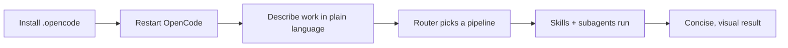

# Usage

How to install, run, and customize `sdlc-lean` in OpenCode. New here? Read the
[README](README.md) first; this file is the hands-on guide.



## 1. Install

**Project-local** — applies to one repo, reviewable in its diff:

```sh
cp -r .opencode /path/to/your-project/
```

**Global** — applies to every project:

```sh
cp -r .opencode/skills/*   ~/.config/opencode/skills/
cp -r .opencode/agents/*   ~/.config/opencode/agents/
cp -r .opencode/commands/* ~/.config/opencode/commands/
mkdir -p ~/.config/opencode/plugins
cp .opencode/plugins/sdlc-lean.js ~/.config/opencode/plugins/
```

> **Do not double-install inside this repo:** OpenCode loads both
> `~/.config/opencode/plugins/` and `<project>/.opencode/plugins/`. With the
> global copy present, opening this repo loads `sdlc-lean` twice under one ID
> and fails with "failed to load plugin sdlc-lean". When hacking on sdlc-lean
> itself, remove the global copy (`rm ~/.config/opencode/plugins/sdlc-lean.js`)
> — the project-local plugin already covers this directory.

Restart OpenCode after installing. No dependencies. Works on OpenCode V1
(1.18.x) and V2 (2.0.x, verified). V2 auto-loads the global plugin from
`~/.config/opencode/plugins/`; the plugin registers safety guards on both
flavors (V1 `tool.execute.before`, V2 `ctx.tool.hook("execute.before")`).

> **V2 tip:** when scripting checks with `opencode run` while a TUI session is
> open, pass `--standalone` — otherwise `run` attaches to the shared background
> service and can collide with your live session.

## 2. Verify it is live

The suite augments the built-in **Build** (and **Plan**) agents — it is not a
separate agent, so switch with <kbd>Tab</kbd> to Build and work as usual.

How you know it is triggered (four independent signals):

| Signal | Where |
|---|---|
| One-time toast **"sdlc-lean active — N skills"** | TUI, first message of a session |
| `Using <skill> to …` announce line | Agent's reply |
| Skill tool call (`→ Skill "brainstorming"`) | TUI activity under the reply |
| Activation status file | `/sdlc-lean` command, or `~/.local/state/sdlc-lean/status.json` |

Quick probes:

| Say this | Expected |
|---|---|
| `Let's add a date picker` | Routes to `brainstorming` (feature pipeline) |
| `This test is failing` | Routes to `systematic-debugging` (bugfix pipeline) |
| `Explain how X works` | Uses `communicating-concisely` (diagram + short prose) |
| `/sdlc-lean` | Prints activation timestamp, install path, and counts |

In headless `opencode run` there is no TUI, so the toast is skipped — the
status file and the announce line still prove activation.

## 3. Everyday use

Nothing to select — describe the work and the router runs the pipeline.

| You want | You say | Pipeline runs |
|---|---|---|
| A new feature | *"Add CSV export to the reports page"* | explore → brainstorm → plan → TDD → review → verify |
| A bug fixed | *"Login 500s on unicode passwords"* | reproduce → root-cause → fix → confirm |
| A cleanup | *"Split this 600-line module"* | impact analysis → behavior-preserving steps |
| A security check | *"Is the upload endpoint safe?"* | read-only traced-path audit |
| A capability you lack | *"We need OCR — find a trusted option"* | trusted-source search → reuse/install |
| External research | *"Compare Postgres vs SQLite for this"* | scope → parallel search → cite → synthesize |

### Pipelines as commands

Every pipeline also has an explicit slash command when you want determinism:

| Command | Flow |
|---|---|
| `/feature <what>` | explore → plan → implement → review → verify |
| `/bugfix <what>` | explore → investigate → fix → review → confirm |
| `/refactor <what>` | impact → decompose → implement → verify |
| `/security-audit [scope]` | audit → scan → dead-code → report (read-only) |
| `/sdlc-lean` | Status: activation proof + installed skills/agents/commands |

## 4. What happens automatically

- **Routing & scrutiny** — the router infers the pipeline and scales effort
  (trivial builds directly; architectural runs the full brainstorming gate).
- **Lean ladder** — every change stops at the earliest rung: need it? → reuse
  in-repo → stdlib → native → installed dep → one line → minimum code.
- **Safety guards** — destructive shell commands are blocked and `.env`/private
  keys are refused, always. Trust-boundary validation, data-loss handling,
  security, and accessibility are never cut.
- **Output contract** — replies respect a ~30-second budget and prefer mermaid
  diagrams and tables over prose walls. Long prose also applies
  `simplified-technical-english` (STE-informed, not certified).
- **Debt ledger** — deferred shortcuts are logged in `docs/debt-ledger.md`
  (format in the `lean-review` skill) instead of expanding an unrelated diff.

## 5. Skills & agents reference

| Skills (30) | Purpose |
|---|---|
| `using-sdlc-lean` | Router: infers pipeline + scrutiny |
| `brainstorming` · `writing-plans` · `executing-plans` · `subagent-driven-development` | Feature flow: design → plan → execute |
| `test-driven-development` · `systematic-debugging` · `verification-before-completion` | Correctness gates |
| `requesting-code-review` · `receiving-code-review` · `lean-review` | Review in/out + over-engineering audit |
| `reviewing-security` · `investigating-performance` · `evolving-schemas` · `writing-release-notes` | Rigor skills |
| `incident-postmortem` · `dependency-upgrade` · `threat-model` · `adr` | Lifecycle: postmortems, safe bumps, design-time threat modeling, decision records |
| `using-git-worktrees` · `dispatching-parallel-agents` · `managing-tasks` | Isolation, parallel work (fan-out/fan-in), persistence |
| `exploring-codebase` · `acquiring-capabilities` · `deep-research` · `communicating-concisely` · `simplified-technical-english` | Orientation, reuse, research, output |
| `writing-skills` · `diagnosing-sdlc` | Meta: author skills, debug the suite |

| Agents (7) | What it does |
|---|---|
| `explorer` | Read-only codebase reconnaissance |
| `researcher` | Web research on one sub-question, returns cited findings |
| `planner` | Produces bite-sized implementation plans |
| `implementer` | Executes one task with TDD |
| `test-writer` | Adds failing-first tests |
| `code-reviewer` | 4-pass diff review |
| `security-reviewer` | Exploitability-ranked findings |

Subagents inherit your configured model. Invoke one directly with `@explorer`
or let a pipeline dispatch it.

## 6. Customize

Fix the model a subagent uses:

```md
---
description: Executes one plan task with TDD, self-review, and evidence reporting
mode: subagent
model: deepseek/deepseek-flash
---
```

Restrict skills per agent (in `opencode.json`):

```json
{ "agent": { "plan": { "permission": { "skill": { "acquiring-capabilities": "deny" } } } } }
```

Add a skill: follow `writing-skills`, then run `node scripts/validate-skills.mjs`.

## 7. Safety & trust

`acquiring-capabilities` gates third-party code by trust tier — verified
installs directly, established needs approval after a security review, unknown
is inspect-only. Trusted sources and install paths:
[`.opencode/skills/acquiring-capabilities/references/trusted-sources.md`](.opencode/skills/acquiring-capabilities/references/trusted-sources.md).

## 8. Update / uninstall

Re-copy `.opencode` from a fresh clone to update. To uninstall, delete the
copied `skills/`, `agents/`, `commands/` entries and the plugin file; remove
the plugin entry from `opencode.json` if you added one.

## 9. Troubleshooting

| Symptom | Fix |
|---|---|
| No skill announced | Confirm `.opencode/skills/*/SKILL.md` exists and restart |
| `/feature` missing | Commands must be in `.opencode/commands/` or `~/.config/opencode/commands/` |
| Plugin not loading | Check the file is `.opencode/plugins/sdlc-lean.js`; V2 needs the repo root to contain `index.js` only if installed as a package |
| "failed to load plugin sdlc-lean" | Duplicate ID: same file in both `~/.config/opencode/plugins/` and `.opencode/plugins/` — remove the global copy when working inside this repo |
| Wrong pipeline chosen | Be explicit (`/bugfix …`) — free-text routing is model-dependent |

## 10. Develop / verify

```sh
npm run verify                     # static skill lint + plugin/budget/safety tests
node scripts/validate-skills.mjs   # lint only
node --test                        # tests only
npm run eval                       # live eval harness — DRY by default
```

The live harness spends nothing without `--run` (capped by `--max-probes`) and
never runs in CI. Results land in `eval/results/` as JSON + markdown, including
tokens and USD cost per run.

Live-harness evidence: [`eval/results/`](eval/results/).
