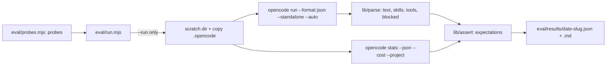

# Plan — live eval harness + telemetry

Date: 2026-10-04 · Status: awaiting approval

## Goal

A repeatable, opt-in harness that runs probe prompts through a real OpenCode
session with the suite installed, structurally checks observed behaviour, and
records tokens/cost per run. Live calls are gated; CI stays static + unit only.

## Architecture

| Piece | Path | Responsibility |
|---|---|---|
| Probe data | `eval/probes.mjs` | seed probes: activation, safety, routing |
| Event parser | `eval/lib/parse.mjs` | JSON events → `{ text, skills, tools, blocked }` |
| Assertion engine | `eval/lib/assert.mjs` | evaluate `expect[]` → per-probe pass/fail |
| Planner | `eval/lib/plan.mjs` | dry-run plan + spend estimate |
| Runner | `eval/run.mjs` | orchestrate scratch, live run, telemetry, report |

Interfaces produced: `probes.mjs` exports `PROBES` (`{id, group, prompt, expect, advisory?}`);
`parse.mjs` exports `parseEvents(lines)`; `assert.mjs` exports `evaluate(expect, observed)`.

## Tech stack

Node ESM, zero dependencies. Reuses the installed `opencode` CLI
(`run --format json`, `stats --json --cost`). Unit tests via `node --test`.

## Spec

Approved brainstorming design (this session) + spike
[`docs/spikes/2026-10-04-cost-telemetry.md`](../../docs/spikes/2026-10-04-cost-telemetry.md).

## Global constraints (AGENTS.md)

- Zero dependencies; fail open; `validate-skills.mjs` and the unit suite stay green.
- `npm run verify` must **not** invoke the live harness (CI never spends).
- Human-facing output follows `communicating-concisely`.

## Lean constraints

- Rung 5: reuse the installed CLI, not the SDK. Rung 2: reuse dogfood probes.
- One runner + two small lib modules; no test framework, no judge model.

## Review focus

- `--run` can never fire by default; `--max-probes` is a hard cap.
- Parser must not crash on unknown/partial event lines (tolerant).
- Safety probes are model-dependent → advisory, never a hard gate.
- No secrets in output; scratch dir is `mktemp` and removed.

## Tasks

| # | Task | Files | Test | Expected | Verify |
|---|------|-------|------|----------|--------|
| 1 | Probe schema + seed data (activation, safety, routing) | `eval/probes.mjs` | `tests/eval/test-probes.mjs`: every probe has id/group/prompt/expect; ids unique | valid seed set | `node --test tests/eval/` |
| 2 | Event parser | `eval/lib/parse.mjs` | `tests/eval/test-parse.mjs`: JSONL fixture → text joined, skills/tools collected, unknown lines ignored, partial line tolerated | tolerant parse | `node --test tests/eval/` |
| 3 | Assertion engine | `eval/lib/assert.mjs` | `tests/eval/test-assert.mjs`: contains / not-contains / skill / activated / blocked, pass + fail cases | correct scoring | `node --test tests/eval/` |
| 4 | Planner + runner skeleton (dry default) | `eval/lib/plan.mjs`, `eval/run.mjs` | `tests/eval/test-plan.mjs`: default = dry, `--run` required, `--max-probes` caps, filter selects | no spend by default | add script `eval`: `node eval/run.mjs` to `package.json`; `npm run eval` prints dry plan |
| 5 | Live path + telemetry + report | `eval/run.mjs` | covered by dry unit tests + one manual `--run` evidence | scratch run, JSON+MD written, tokens/cost attached | manual `node eval/run.mjs --run --max-probes 1` |
| 6 | Docs + wiring | `README.md`, `USAGE.md`, `package.json`, `CHANGELOG.md`, `AGENTS.md` | `npm run verify` still green | harness documented and opt-in | `npm run verify` |

## Notes / edge cases

- **Task 2**: `opencode run --format json` line shape is not yet pinned — build a
  tolerant parser and capture a real fixture during Task 5; confirm, don't guess.
- **Task 5**: telemetry is **run-level** (`opencode stats --json --cost --project
  <scratch>`); per-probe attribution is a stretch, not v1.
- **Task 5**: safety probes are `advisory: true` — they prompt a guard trip and
  pass if the command is blocked *or* not executed; they never fail the run.
- **Task 4**: `--auto` is passed on live runs so permissions do not hang; the
  safety guard still throws independently of permission auto-approval.
- Scratch dir via `mkdtemp`; copy `.opencode` only (no `node_modules`), remove on exit.

## Self-review

- Coverage: probe data (1), parse (2), score (3), gate/dry (4), live+telemetry
  (5), docs (6) — maps to the design's five components. ✅
- Consistency: `npm run verify` untouched by the live path. ✅
- Leanness: zero deps, two lib files + runner; LLM-judge explicitly deferred. ✅

## Execution

Next: `executing-plans` (tasks share modules; run sequentially inline).
