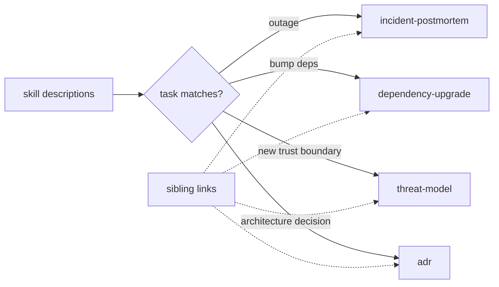

# Plan — lifecycle skills (4)

Date: 2026-10-04 · Status: awaiting approval

## Goal

Add four description-triggered lifecycle skills — `incident-postmortem`,
`dependency-upgrade`, `threat-model`, `adr` — as minimal one-screen checklists,
wired by their `description` plus cheap sibling links. No router growth (the
5KB bootstrap gate stays untouched).

## Architecture

Four `SKILL.md` files under `.opencode/skills/<name>/`. No plugin change, no
router edit. Sibling links: `reviewing-security` → `threat-model`,
`systematic-debugging` → `incident-postmortem`, `evolving-schemas` → `adr`,
`writing-release-notes` → `dependency-upgrade`.

## Tech stack

Markdown skills; lint via `node scripts/validate-skills.mjs`; shipping
assertions in `tests/opencode/test-plugin-loading.mjs`. Zero dependencies.

## Spec

Approved brainstorming (this session). Authoring rules: `writing-skills`.

## Global constraints (AGENTS.md)

- New skill follows `writing-skills`: minimal, `Use when…` description only,
  name == dir, regex-valid. Lint must pass.
- Bootstrap stays <5KB — **no router edits**.
- Human-facing output follows `communicating-concisely`.

## Lean constraints

- Rung 7: minimum content — a checklist per skill, no reference files.
- Reuse existing sibling skills for cross-links; no new dependency.

## Review focus

- Descriptions are triggers, not workflow summaries (SDO rule).
- Skills don't overlap existing ones (e.g. debugging vs postmortem).
- No bootstrap byte change.

## Tasks

| # | Task | Files | Test | Expected | Verify |
|---|------|-------|------|----------|--------|
| 1 | Shipping assertions (RED) | `tests/opencode/test-plugin-loading.mjs` | four skills ship; each description starts with "Use when"; router/bootstrap unchanged | test fails until skills exist | `node --test` |
| 2 | Author `incident-postmortem` | `.opencode/skills/incident-postmortem/SKILL.md` | lint | blameless checklist | `node scripts/validate-skills.mjs` |
| 3 | Author `dependency-upgrade` | `.opencode/skills/dependency-upgrade/SKILL.md` | lint | safe-bump checklist | lint |
| 4 | Author `threat-model` | `.opencode/skills/threat-model/SKILL.md` | lint | STRIDE-lite checklist | lint |
| 5 | Author `adr` | `.opencode/skills/adr/SKILL.md` | lint | record + immutability checklist | lint |
| 6 | Sibling links | `reviewing-security`, `systematic-debugging`, `evolving-schemas`, `writing-release-notes` SKILL.md | lint | each links its lifecycle skill | lint + tests |
| 7 | Docs sync (26→30) | `README.md`, `USAGE.md`, `CHANGELOG.md` | `npm run verify` | counts match disk; four listed | `npm run verify` |

## Notes / edge cases

- **Descriptions**: "Use when…" conditions only (e.g. `adr`: "Use when a
  significant architectural decision is made and must be recorded"). No
  workflow summary in the description.
- **Task 1**: assert `getBootstrapContent()` byte length is unchanged (guard
  against accidental router edits).
- **Task 6**: links add a line to an existing skill body, never to the router.

## Self-review

- Coverage: four skills (2–5), discoverability (1,6), docs (7). ✅
- Consistency: no router edit anywhere; bootstrap stays 5116. ✅
- Leanness: four minimal skills; no references, no templates, no new deps. ✅

## Execution

Next: `executing-plans` inline (TDD: test first).
