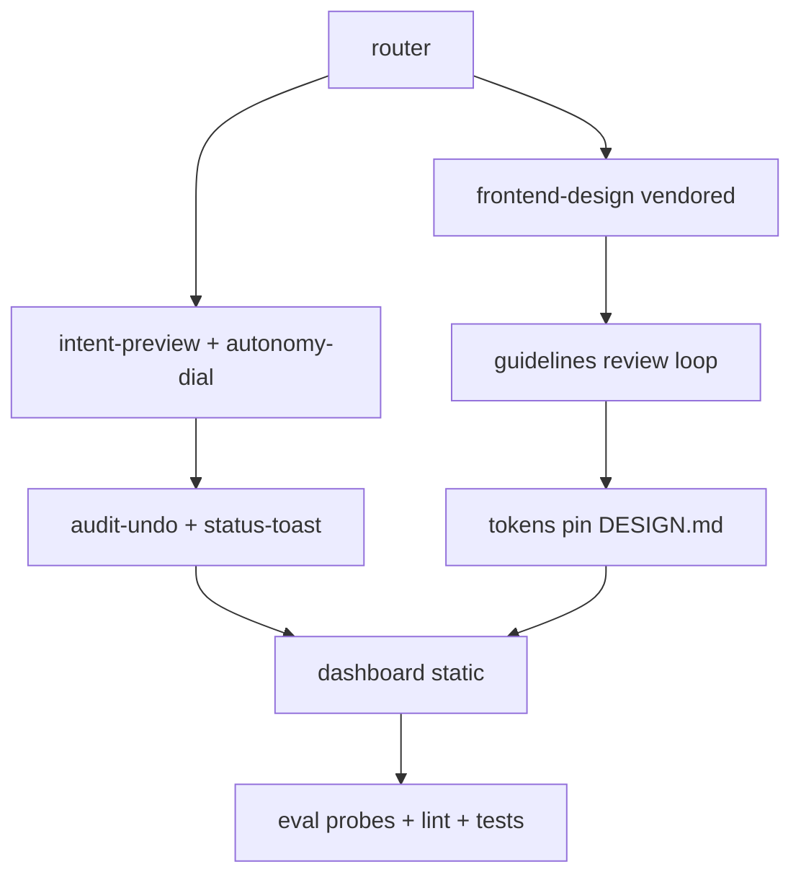

# Plan — UI/UX SOTA parity (agent UX + frontend skills + dashboard)

**Goal**: Bring sdlc-lean to 2026 leader parity: no-fork agent UX (preview, dial, audit) plus vendored frontend skills (React+Tailwind+shadcn) plus read-only companion dashboard, reusing only verified/permissive sources with attribution.

**Architecture**: touches `.opencode/skills/*/SKILL.md` (new: `intent-preview`, `frontend-design`, `ui-review`; upgraded router), `.opencode/commands/*.md` (preview command), `.opencode/plugins/sdlc-lean.js` (status/toast/audit hooks, zero-dep, V1+V2), `scripts/dashboard.mjs` + `docs/dashboard.html` (static read of `status.json`, `eval/results`, progress ledgers), `DESIGN.md` + tokens. Consumes: `session.*`, `todo.updated`, `permission.asked`, `tui.*`, shadcn MCP. Produces: preview accept flow, audit ledger, `file:line` UI findings, static dashboard.

**Tech stack**: Node 22 + vanilla JS (zero-dep plugin), Markdown skills, `node --test`, `node scripts/validate-skills.mjs`. Counts: 32→36 skills. Test: `npm run verify`.

**Spec**: `docs/spikes/2026-10-05-uiux-sota.md` (APPROVED) + `docs/spikes/2026-10-05-popular-skills.md` (20 sources).

**Global Constraints**: AGENTS.md — `name==dir`, `Use when…` descriptions, no hardcoded models, V1+V2 fail-open, exact-known guards only + benign test, bootstrap <5KB, STE-lite visuals, trust tiers + pin + security review, never auto-install unknown.

**Lean Constraints**: rung 2 reuse-first (anthropics MIT/Apache, vercel MIT, shadcn MCP, native `tui.json`/`commands`/`session` hooks); rung 4 native platform over library; rung 6 minimal new skills (3) + 1 static dashboard; proprietary UX rewritten from description, never copied.

**Review Focus**: license attribution + pinned commits; SUL-1.0 contamination check; bootstrap bytes; fail-open hooks; probe model-lottery avoidance; dashboard no auth/sync creep.

| # | Task | Files | Test | Expected | Verify |
|---|------|-------|------|----------|--------|
| 1 | Vendor `frontend-design` (Apache-2.0): fetch SKILL.md + LICENSE, adapt to suite format, attribution + pinned commit | `.opencode/skills/frontend-design/SKILL.md`, `references/ATTRIBUTION.md` | `node scripts/validate-skills.mjs` + license header present | skill lints, trigger pressure-tested | `npm run lint` |
| 2 | Vendor `ui-review` from vercel guidelines + `react-best-practices` (MIT): minimal wrapper, per-run fetch note, `file:line` output | `.opencode/skills/ui-review/SKILL.md`, `references/ATTRIBUTION.md` | lint + `web-design-guidelines` trigger test | terse findings, no wall | `npm run lint` |
| 3 | `intent-preview` skill + `/preview` command: plan approval (Shift+Tab pattern reimplemented), accept/edit flow | `.opencode/skills/intent-preview/SKILL.md`, `.opencode/commands/preview.md` | lint + dry eval probe structural | preview → accept rate signal | `node --test tests/eval/` |
| 4 | Autonomy-dial + audit-undo: permission tiers Observe→Auto, ledger from `session.*`/`file.edited`/`tool.execute.*` | `.opencode/skills/autonomy-dial/SKILL.md`, `docs/audit-ledger.md` | unit test ledger append + reversion target | <5% reversion path | `node --test` |
| 5 | Plugin status-toast upgrade: `tui.toast.show`, `session.status/idle`, fail-open, V1+V2, bytes-neutral | `.opencode/plugins/sdlc-lean.js`, `tests/opencode/test-ux-hooks.mjs` | TDD RED→GREEN hook test | toast + status, no break | `npm run verify` |
| 6 | Tokens pin: `DESIGN.md` + `tokens.css` vars + shadcn MCP usage note, Radix→Base guard | `DESIGN.md`, `docs/tokens.css` | file exists + MCP command documented | no upstream churn | `ls DESIGN.md` |
| 7 | Static dashboard: reads `status.json`, `eval/results`, progress ledgers; zero-dep serve | `scripts/dashboard.mjs`, `docs/dashboard.html` | serves locally, renders fixtures | read-only, no auth | `npm run dashboard -- --check` |
| 8 | Router + docs sync: route UI intents, counts 32→35, USAGE/CHANGELOG/AGENTS | `.opencode/skills/using-sdlc-lean/SKILL.md`, `README/ USAGE/ CHANGELOG` | bootstrap ≤5120B test | routing correct | `npm run verify` |
| 9 | Eval + review gates: 3 new probes, `reviewing-security` + `lean-review`, fresh evidence | `eval/probes.mjs`, `tests/eval/` | `npm run eval` dry lists 14 | no lottery probes | `npm run eval` |

Self-review: coverage — intent/audit (T3-5), frontend clone (T1-2,6), dashboard (T7), wiring (T8), gates (T9); consistency — no fork, no new dep, SUL excluded; leanness — 3 new skills only, dashboard static, commercial Figma excluded.
