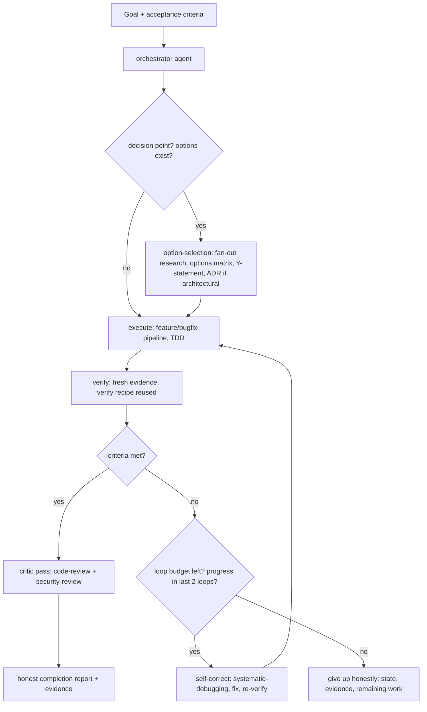

# Autonomous Orchestration + Research-First Option Selection — Design (brainstorming)

Date: 2026-10-04 · Route: feature (architectural) · Status: design (user pre-authorized autonomy)

## Goal

Make sdlc-lean a SOTA autonomous suite: an agent that takes a goal, loops by
itself (route → research → pick the best option → plan → execute → verify →
self-correct) until acceptance criteria are met or an honest budget stop —
with research-first option selection at every decision point.

## Research grounding (3 parallel researchers, 2026-10-04)

Proven SOTA patterns found (sources: openai.com Codex agent loop, Claude Code
skills, Gemini CLI subagents, OpenHands verification stack, Anthropic
multi-agent research, opencode.ai/docs):

| Pattern | Source | We reuse |
|---|---|---|
| plan → execute → verify → self-correct loop, plan updated mid-loop | Codex, OpenHands | existing pipeline skills |
| orchestrator → parallel subagents → consolidated summary | Anthropic, Claude, Gemini, OpenCode | dispatching-parallel-agents |
| read-only research/explore vs write-enabled build agents | all | existing agents + permission matrix |
| iterate-until-green + "gives up honestly" after budget | OpenHands | NEW loop protocol |
| verification recipe remembered per project | Claude Code `/verify` | NEW verify-recipe file |
| research fan-out scaled to decision impact; options matrix; Y-statement | Anthropic, MADR/ADR | NEW option-selection skill |
| iteration caps, stuck-loop detection, compaction memory | OpenCode native (`steps`, `doom_loop`, `experimental.session.compacting`) | native config, zero code |

Gap we fill that no mainstream tool formalizes: **compare-then-commit decision
protocol** (research → options matrix → pick → record) before building.

## Alternatives considered

| Option | Rejected because |
|---|---|
| Code-level orchestrator loop in the plugin | OpenCode already loops (inference→tool→inference); plugin code would duplicate the platform |
| Agent framework (LangGraph/ADK/etc.) | New dependency, not OpenCode-native, violates zero-dep bootstrap |
| Router text only ("keep going until done") | No budgets/stop criteria; SOTA requires explicit stop conditions |
| Orchestrator agent without a protocol skill | Default agent must loop too; skill self-triggers anywhere |
| Full A/B spike harness for option selection | YAGNI; static options-matrix + live research covers decisions |

## Architecture

## Components (lean ladder: no new deps, no plugin loop code)

| Component | File | Notes | Rung |
|---|---|---|---|
| `option-selection` skill | `.opencode/skills/option-selection/SKILL.md` | trigger: "choose between / which option / is X better than Y / best way"; ≥2 options × criteria × tradeoffs table, research effort scaled to impact (fan-out), pick + Y-statement, ADR for architectural, cite sources | 2: reuses deep-research + adr + dispatching-parallel-agents |
| `autonomous-loop` skill | `.opencode/skills/autonomous-loop/SKILL.md` | goal w/ acceptance criteria → route → loop protocol; budgets: max 3 iterations (default), stop on criteria-met / 2 no-progress loops / budget-out; give-up-honestly report | 4: OpenCode native `steps`, `doom_loop`, todo, sessionID continuation |
| `orchestrator` agent | `.opencode/agents/orchestrator.md` | `mode: primary`; `permission.task` allowlist (research/explore/implement/test-write/review); `steps` cap; `subagent_depth: 2`; `todowrite: true`; follows the two skills | 4: native agent file |
| verify recipe | `verification-before-completion` + `docs/verify-recipe.md` | first loop writes project verification commands; later loops reuse (Claude Code `/verify` pattern) | 6: ~4 lines |
| compaction memory | `.opencode/plugins/sdlc-lean.js` | `experimental.session.compacting` hook injects debt ledger + active plan/progress pointers into compaction summaries; fail-open | 4: native hook, ~20 lines |
| wiring | router (byte-neutral), sibling links deep-research + acquiring-capabilities → option-selection | bootstrap must stay ≤5116 B (D-005) | — |
| evals + tests | `eval/probes.mjs` +3 probes; `test-plugin-loading.mjs` shipping/no-growth assertions | routing: goal-driven, comparison, loop-budget | — |

## Non-goals

No new runtime, no dependencies, no plugin-side control loop, no user-facing
intensity levels, no weakening of safety guards (`--auto` stays the user's
explicit choice), no auto-install of third-party code (trust tiers unchanged).

## Budgets & stop rules (from research)

- Iterations: default 3, per-goal override. Steps cap in agent frontmatter.
- Research effort scales with decision impact (Anthropic effort budgets):
  trivial = zero research; standard = 1 researcher, 3–5 searches; architectural
  = 2–4 parallel researchers.
- Stop = criteria met with fresh evidence, OR 2 consecutive no-progress loops
  (change strategy), OR budget out → honest report (state, evidence, rest).

## Open questions (decided at plan time)

1. Default iteration cap 3 — confirmed.
2. `orchestrator` visible in agent menu (mode primary) — yes.
3. Loop protocol lives in a skill (any agent benefits) + agent pre-wires config — yes.

## Handoff

Next: `writing-plans` (per brainstorming, architectural → plans only).
