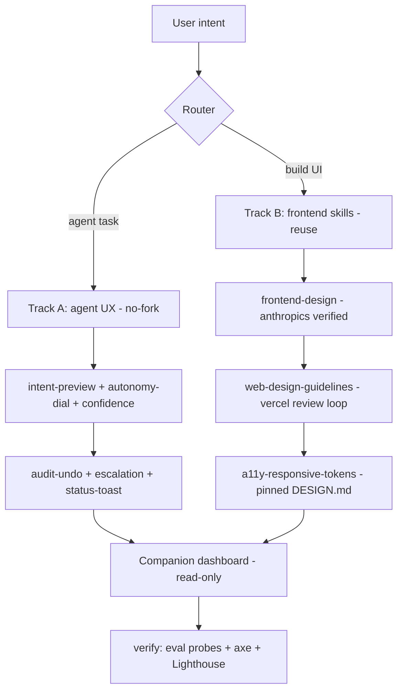

# UI/UX SOTA Enhancement — Design (Architectural)

Date: 2026-10-05 · Status: APPROVED 2026-10-05 · Tracks: both · Stack: React+Tailwind+shadcn · Boundary: no-fork core + companion dashboard allowed

## Approved clone targets (user-approved 2026-10-05)

- Clone/adapt with attribution: `anthropics/frontend-design` (Apache-2.0), `vercel/web-design-guidelines` + `react-best-practices` (MIT, pin commit + per-run fetch), `web-artifacts-builder` single-HTML pattern (after license check), `canvas-design` (after license check).
- Reuse protocol: shadcn MCP + `components.json`, v0 adapter pattern.
- Inspiration-only rewrite: oh-my-openagent (SUL-1.0, no copy), Cursor Projects / Claude plan-mode / Codex diff / Copilot steer (proprietary UX, reimplement from description).

## Goal

Bring sdlc-lean UX to parity with 2026 market leaders (Claude Code 39% adoption [JetBrains Aug 2026], Cursor Projects, Codex cloud) on two tracks:
(A) suite's own agent UX inside OpenCode, (B) frontend-building power so agents output SOTA web UIs. Strictly reuse verified sources; exclude voice/multimodal + personalization.

## Non-goals

- Voice, multimodal, chat+canvas, personalization/memory store (excluded per scope answer; insufficient evidence base).
- Fork of OpenCode TUI for custom widgets/panels (docs show no no-fork API; fork = upgrade breakage).
- Inventing a new component library or design tokens from scratch.
- Auto-install of unknown community skills without review.

## Alternatives considered

| Option | Why rejected |
|---|---|
| Fork OpenCode TUI for rich panels/widgets | Upgrade breakage, maintenance burden; docs confirm no no-fork widget API — lean rung 1 fails (don't need the pain). |
| Build bespoke design system from zero | Reinvents shadcn/Tailwind training-data + MCP advantage; violates reuse-before-rebuild (`acquiring-capabilities`). |
| Blind-install 8 opencodeskills.dev design skills | Single-source, unverified tier → inspect-only per trust tiers; propose + review first. |
| Full IDE extension (VS Code/Cursor parity) | Out of scope for OpenCode-native suite; ACP + split-terminal + `/editor` reuse covers 80% without new surface. |
| Voice/personalization now | No concrete evidence base in fetched sources; YAGNI — revisit when docs/adoption exist. |
| Live collaborative dashboard with auth/sync | Over-engineering vs read-only local dashboard from existing ledgers; security + scope cost. |

## Architecture

| Component | Interface consumed / produced | Reuse source |
|---|---|---|
| intent-preview | `commands/*.md` + `permission.asked` + plan approval UX; produces accept rate | Smashing Intent Preview pattern; Claude Plan agent |
| autonomy-dial | `opencode.json` permission + `todowrite` + `task` allowlist; Observe→Auto | Cursor Projects coordinator; Claude effort fields |
| audit-undo | `session.*` + `file.edited` + `tool.execute.*` events → ledger; `<5% reversion target` | Smashing Action Audit; OpenCode session diff |
| status-toast | `tui.toast.show`, `session.status/idle`, server `/tui/*`; no custom widgets | `opencode.ai/docs/plugins`, `/server`, `/tui` |
| frontend-design | `SKILL.md` vendored reference; React+Tailwind+shadcn default | `anthropics/skills` verified, 954k installs |
| ui-review | `file:line` findings on design/a11y/UX; fetch latest guidelines per run | `vercel-labs/agent-skills` established, needs approval |
| tokens-pin | `DESIGN.md` + `tokens.css` + `--font-*` vars; shadcn Registry via MCP | `v0.app/docs/design-systems` |
| dashboard | Reads `status.json`, `todo`, `eval/results/*.md`, `docs/plans/*-progress.md`; `npm run dashboard` static serve | Zero-dep static HTML; no auth/sync |

## Lean check

1. Need it? Yes — adoption data shows agent UX is the differentiator; suite has zero UI layer today (explored: plugin bootstrap only, no toast/status upgrade).
2. Already in codebase? Reuse `communicating-concisely` 30s contract, `todo.updated`, `session.*` hooks, `eval/results` reporters.
3. Stdlib? Node static serve for dashboard, no framework.
4. Native platform? OpenCode `tui.json` themes/keybinds, `commands/*.md`, `permission.skill`, ACP — over custom chrome.
5. Installed dep? shadcn via MCP/registry, axe-core/Lighthouse for checks — no new bundled dep.
6. Only then: minimum new skills (2-3) + 1 static dashboard + intent-preview command.

## Open questions

1. Vercel `web-design-guidelines` is established-tier (699k installs) — approve vendoring with per-run fetch, or pin snapshot?
2. Dashboard live-refresh scope: static snapshot now, SSE later — accept staged?
3. shadcn commercial Figma skills excluded (non-MIT) — confirm token-sync stays manual via MCP?
